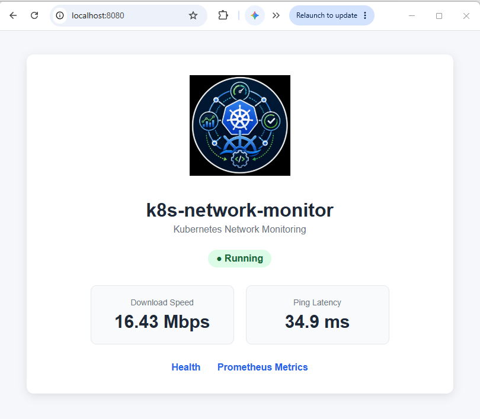

# k8s-network-monitor

> A lightweight Kubernetes-native application for monitoring internet performance and exposing network measurements as Prometheus metrics.

[](https://github.com/pymisc/k8s-network-monitor/actions/workflows/ci-cd.yaml)
[](https://app.codecov.io/gh/pymisc/k8s-network-monitor)
[](https://github.com/users/pymisc/packages/container/package/k8s-network-monitor)


---

## Overview

**k8s-network-monitor** is a small cloud-native network monitoring application designed to run inside Kubernetes.

The application periodically measures internet performance and exposes the results through a Prometheus-compatible `/metrics` endpoint.

The current implementation intentionally focuses on two core measurements:

- Internet download bandwidth
- Internet ping latency

The project also demonstrates practical platform-engineering concepts including:

- Python application development
- Containerization with Docker
- Kubernetes deployments
- Helm packaging
- Prometheus metrics
- Grafana visualization
- CI/CD with GitHub Actions
- Python linting
- Automated testing and code coverage
- Source and container vulnerability scanning
- Container publishing to GHCR

---

## Application Preview

The application provides a lightweight status page showing the latest
network measurements collected by `k8s-network-monitor`.



The application currently tracks two network metrics:

- **Download Speed** — exposed as `internet_download_mbps`
- **Ping Latency** — exposed as `internet_ping_latency_ms`

These metrics are exposed through the `/metrics` endpoint in Prometheus
format and can be collected by the Kubernetes observability stack for
visualization in Grafana.

```text
Internet Connection
        │
        ▼
k8s-network-monitor
        │
        ├── Application Status Page
        │
        └── /metrics
              │
              ▼
          Prometheus
              │
              ▼
            Grafana
```

---

## Architecture

```text
                    Internet
                       │
                       │ Network Test
                       ▼
             ┌─────────────────────┐
             │ k8s-network-monitor │
             │                     │
             │   Python App        │
             │   Network Probe     │
             │   Metrics Exporter  │
             └──────────┬──────────┘
                        │
                        │ /metrics :8080
                        ▼
                 Prometheus Metrics
                        │
                        ▼
                Grafana / Grafana Cloud
                        │
                        ▼
                   Dashboard
```

The application runs as a containerized workload inside Kubernetes and exposes network measurements in Prometheus format.

---

## Metrics

The current version exposes two application-specific network performance metrics.

| Metric | Description | Unit |
|---|---|---|
| `internet_download_mbps` | Current internet download bandwidth | Mbps |
| `internet_ping_latency_ms` | Current internet ping latency | milliseconds |

Example output from the running application's `/metrics` endpoint:

```text
# HELP internet_download_mbps Current internet download bandwidth in Mbps
# TYPE internet_download_mbps gauge
internet_download_mbps 20.46

# HELP internet_ping_latency_ms Current internet ping latency in milliseconds
# TYPE internet_ping_latency_ms gauge
internet_ping_latency_ms 21.0
```

The `/metrics` endpoint also includes standard Python runtime and process metrics provided automatically by the Prometheus Python client.

The application-specific monitoring scope is intentionally small for now. Additional network observability metrics may be introduced as the project evolves.

---

## Application Endpoints

The application exposes HTTP endpoints on port `8080`.

### `/`

Basic application endpoint used to confirm that the service is reachable.

### `/health`

Health-check endpoint used to verify that the application is running.

### `/metrics`

Prometheus-compatible metrics endpoint.

Example:

```bash
curl http://localhost:8080/metrics
```

---

## Container Image

Container images are published to GitHub Container Registry:

```text
ghcr.io/pymisc/k8s-network-monitor
```

Images are published only after the CI/CD pipeline successfully completes the required quality and security gates.

Pull the latest image:

```bash
docker pull ghcr.io/pymisc/k8s-network-monitor:latest
```

---

## Kubernetes Deployment

The application is packaged as a Helm chart under:

```text
helm/k8s-network-monitor/
```

### Prerequisites

The deployment requires:

- Kubernetes cluster
- `kubectl`
- Helm 3.x
- Prometheus-compatible metrics backend for metrics collection
- Grafana or Grafana Cloud for visualization

---

## Deploy Using the Helper Script

A deployment helper script is included with the repository:

```text
scripts/deploy_app.sh
```

The script is designed to be executed **from the repository root**.

```bash
git clone https://github.com/pymisc/k8s-network-monitor.git

cd k8s-network-monitor

./scripts/deploy_app.sh
```

The deployment script:

1. Installs or upgrades the Helm release.
2. Waits for the Kubernetes Deployment rollout to complete.
3. Displays Deployment status.
4. Displays Pod and Service status.

This provides a simple and repeatable way to deploy or upgrade the application.

---

## Deploy Directly with Helm

The application can also be deployed directly with Helm without using the helper script.

```bash
helm upgrade --install network-monitor \
  ./helm/k8s-network-monitor \
  --namespace monitoring \
  --create-namespace
```

Verify the deployment:

```bash
kubectl get deployments -n monitoring
kubectl get pods -n monitoring
kubectl get services -n monitoring
```

Check the rollout:

```bash
kubectl rollout status \
  deployment/network-monitor-k8s-network-monitor \
  -n monitoring
```

---

## Verify the Metrics Endpoint

The application's Prometheus metrics can be verified directly from a Kubernetes deployment using port forwarding.

First, identify the Service:

```bash
kubectl get svc -n monitoring
```

Forward local port `8080` to the application Service:

```bash
kubectl port-forward \
  -n monitoring \
  svc/network-monitor-k8s-network-monitor \
  8080:8080
```

Keep the port-forward command running and open another terminal.

Query all metrics:

```bash
curl -s http://localhost:8080/metrics
```

To display only the application-specific metrics:

```bash
curl -s http://localhost:8080/metrics \
  | grep -E '(^# HELP internet_|^# TYPE internet_|^internet_)'
```

Expected application-specific metrics:

```text
internet_download_mbps
internet_ping_latency_ms
```

---

## Prometheus Integration

The application exposes Prometheus-compatible metrics through:

```text
/metrics
```

The two application-specific metrics are:

```text
internet_download_mbps
internet_ping_latency_ms
```

A Prometheus-compatible monitoring system can scrape this endpoint and store the measurements as time-series data.

The collected data can then be queried and visualized using Grafana.

---

## Grafana Dashboard

Grafana can be used to visualize the network measurements over time.

### Download Bandwidth

PromQL:

```promql
internet_download_mbps
```

This metric can be used to visualize changes in measured internet download bandwidth.

### Ping Latency

PromQL:

```promql
internet_ping_latency_ms
```

This metric can be used to visualize changes in internet latency and identify periods of degraded network responsiveness.

> **Coming soon**
>
> Helm chart support for deploying/configuring the Grafana dashboard will be added in an upcoming update.
>
> This will make the dashboard deployment more repeatable and allow the monitoring visualization to be managed alongside the application.

---

## CI/CD Pipeline

The repository uses GitHub Actions to implement a gated CI/CD pipeline.

```text
                         Code Push / Pull Request
                                  │
                                  ▼
                            Python Lint
                                  │
                         ┌────────┴────────┐
                         ▼                 ▼
                Tests & Coverage    Source Security
                         │                 │
                         └────────┬────────┘
                                  ▼
                            Docker Build
                                  │
                                  ▼
                       Container CVE Scan
                                  │
                                  ▼
                          Publish to GHCR
```

The pipeline follows a **fail-fast** approach.

A failure in an earlier quality or security gate prevents unnecessary downstream build or publishing operations from proceeding.

### Pipeline Gates

| Gate | Purpose |
|---|---|
| Python Lint | Detect Python code errors early |
| Tests & Coverage | Validate application behavior and measure code coverage |
| Source Security | Scan source/filesystem content for security vulnerabilities |
| Docker Build | Build the deployable container image |
| Container CVE Scan | Scan the built container for HIGH/CRITICAL vulnerabilities |
| Publish | Publish the validated container image to GHCR |

The container pipeline is optimized so that the image used by later stages does not need to be unnecessarily rebuilt multiple times.

---

## Security

Security validation is integrated directly into the CI/CD workflow.

The project includes:

- Python linting
- Automated unit testing
- Code coverage reporting
- Trivy source/filesystem scanning
- Trivy container-image vulnerability scanning
- HIGH/CRITICAL CVE gating before image publication
- Minimal Python container base image
- Dependency and base-image updates through container rebuilds

The production container image must pass the configured pipeline gates before publication to GHCR.

---

## Technology Stack

| Component | Technology |
|---|---|
| Application | Python |
| Container | Docker |
| Orchestration | Kubernetes |
| Packaging / Deployment | Helm |
| Metrics | Prometheus |
| Visualization | Grafana / Grafana Cloud |
| CI/CD | GitHub Actions |
| Testing | Pytest |
| Code Coverage | Codecov |
| Linting | Pylint |
| Security Scanning | Trivy |
| Container Registry | GitHub Container Registry (GHCR) |

---

## Project Structure

```text
k8s-network-monitor/
│
├── .github/
│   └── workflows/
│       └── ci-cd.yaml
│
├── app/
│
├── helm/
│   └── k8s-network-monitor/
│       ├── Chart.yaml
│       ├── values.yaml
│       └── templates/
│
├── scripts/
│   └── deploy_app.sh
│
├── tests/
│
├── Dockerfile
├── requirements.txt
├── pytest.ini
├── codecov.yml
├── .python-version
├── README.md
└── LICENSE
```

---

## Roadmap

### Current

- [x] Python network monitoring application
- [x] Internet download bandwidth measurement
- [x] Internet ping latency measurement
- [x] Prometheus `/metrics` endpoint
- [x] Docker container
- [x] Kubernetes deployment
- [x] Helm application chart
- [x] Deployment helper script
- [x] Python linting
- [x] Automated testing
- [x] Code coverage reporting
- [x] Source vulnerability scanning
- [x] Container CVE scanning
- [x] GHCR container publishing
- [x] Gated CI/CD pipeline
- [x] Grafana visualization

### Next

- [ ] Grafana dashboard Helm integration
- [ ] Improved dashboard deployment automation
- [ ] Additional network observability metrics
- [ ] Additional health probes
- [ ] Alerting
- [ ] GitOps deployment with Argo CD

---

## Project Goals

This project is intentionally designed as both a useful network-monitoring application and a hands-on platform-engineering project.

It demonstrates the lifecycle of a small cloud-native service:

```text
Develop
   │
   ▼
Lint
   │
   ▼
Test
   │
   ▼
Security Scan
   │
   ▼
Build Container
   │
   ▼
Scan Container
   │
   ▼
Publish
   │
   ▼
Deploy with Helm
   │
   ▼
Observe with Prometheus + Grafana
```

The emphasis is not only on writing the application, but also on building a **repeatable, secure, observable delivery process around it**.

---

## License

This project is licensed under the MIT License.

See `LICENSE` for details.